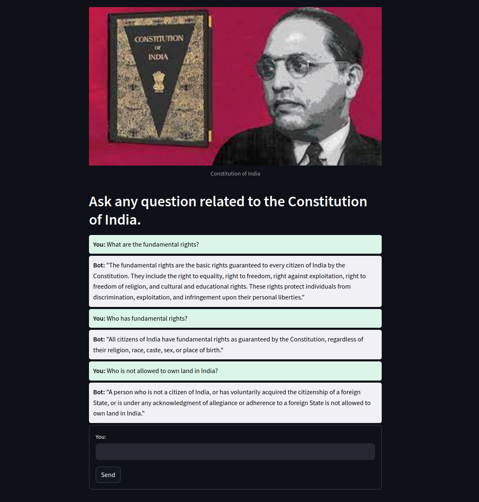

# Indian Constitution Q&A App
Welcome to the Indian Constitution Q&A App! This application allows users to ask any question about the Constitution of India and get precise answers extracted directly from the document using state of the Art LLM and Langchain technologies.



## Features

- **Interactive Q&A**: Users can ask questions and get answers from the Constitution of India.
- **Powered by Langchain and GPT**: Utilizes advanced language models to provide accurate responses.
- **Vector Space Storage**: Uses Cassandra with AstraDB for efficient storage and retrieval of document vectors.
- **Streamlit Interface**: Simple and user-friendly interface built with Streamlit.
- **Deployed on Hugging Face Spaces**: Accessible at [Indian Constitution Q&A App](https://huggingface.co/spaces/Amitprataprana/IndianConstituionQ-ALangchain).

## Technologies Used

- **Langchain**: Framework for developing applications powered by language models.
- **GPT (Generative Pre-trained Transformer)**: Advanced language model for understanding and generating human-like text.
- **Cassandra**: NoSQL database for storing vector spaces of the Constitution PDF.
- **AstraDB**: Cloud-native database service by DataStax, used for scalable and secure storage.
- **Streamlit**: Python library for creating interactive web applications.

## How It Works

1. **User Query**: Enter a question related to the Constitution of India in the input box.
2. **Processing**: The app processes the query using Langchain and GPT to understand the context and fetch relevant information.
3. **Vector Retrieval**: Utilizes Cassandra with AstraDB to retrieve the vector space of the Constitution PDF for accurate answers.
4. **Response**: The app displays the answer directly from the Constitution of India.

## Getting Started

Follow these steps to get the app running on your local machine:

### Prerequisites

- Python 3.7 or higher
- Streamlit
- Langchain
- OpenAI GPT
- Cassandra
- AstraDB

### Installation

1. Clone the repository:
    ```sh
    git clone https://github.com/your-username/indian-constitution-qa.git
    ```
2. Navigate to the project directory:
    ```sh
    cd indian-constitution-qa
    ```
3. Install the required packages:
    ```sh
    pip install -r requirements.txt
    ```

### Running the App

1. Start the Streamlit app:
    ```sh
    streamlit run app.py
    ```
2. Open your web browser and go to `http://localhost:8501` to interact with the app.

## Deployment

The app is deployed on Hugging Face Spaces and can be accessed directly at [Indian Constitution Q&A App](https://huggingface.co/spaces/Amitprataprana/IndianConstituionQ-ALangchain).

## Contributing

We welcome contributions! Please follow these steps to contribute:

1. Fork the repository.
2. Create your feature branch:
    ```sh
    git checkout -b feature/YourFeature
    ```
3. Commit your changes:
    ```sh
    git commit -m 'Add some feature'
    ```
4. Push to the branch:
    ```sh
    git push origin feature/YourFeature
    ```
5. Open a pull request.

## License

This project is licensed under the MIT License. See the [LICENSE](LICENSE) file for details.

## Contact

For any inquiries or feedback, please contact:

- **Amit Kumar**
  - Email: amitprataprana41@gmail.com
  - LinkedIn: [Amit Kumar](https://www.linkedin.com/in/amit-kumar-7b72b9176/)
  - GitHub: [Amit Kumar](https://github.com/AmitKumar7138)

---

Thank you for using the Indian Constitution Q&A App!
